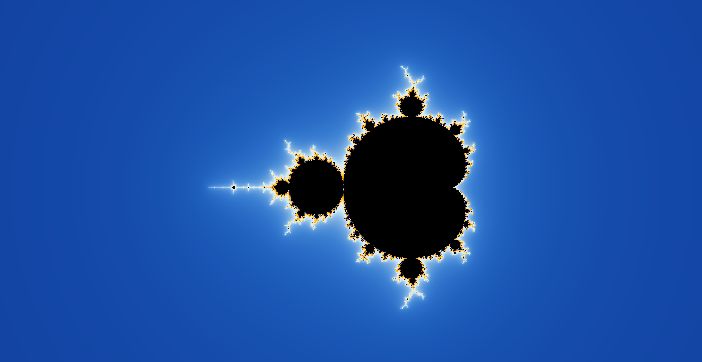
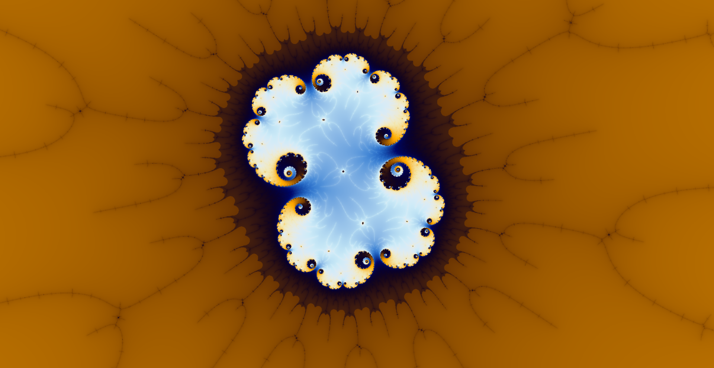

# Visualizador de fractais

Acesse diretamente no navegador, usando o link:

<https://thiagomaxpavao.github.io/fractal-visualizer>

Este visualizador foi feito utilizando a biblioteca *p5.js* da fundação [Processing](https://processingfoundation.org/) na versão web, e o software de programação Processing para a versão desktop.

## Tutorial

Ao entra no link acima, será gerado o fractal mais comumente visto, gerado pela sequência z_{n+1} = z_{n} ^2 + c.

Para explorar, basta utilizar o scroll do mouse para dar zoom e segurar/arastar o botão esquerdo do mouse para navegar.

Será necessário re-renderizar a imagem após certos intervalos de zoom, para obter uma imagem nítida novamente. Para isso basta clicar no botão no extremo esquerdo superior da tela.

É possível ajustar dois parâmetros na renderização:

- O número máximo de interações para cada ponto. Aumentar esse valor aprimora a quantidade de detalhe na imagem, porém também aumenta o tempo de espera para a renderização.

- O multiplicador de resolução. Este valor pode ser alterado para gerar uma imagem de resolução diferente da mostrada na tela na hora da renderização. Colocar o valor dois por exemplo, ira gerar uma imagem com 4 vezes mais pixels, que possibilitará mais zoom sem a necessidade de renderizar novamente, mas que também demorará 4 vezes mais para renderizar. Se a renderização tem demorado muito, diminuir este valor pode ajudar.

Por fim, é possível trocar a equação utilizada para gerar o fractal. Sendo possível escolher entre um fractal do tipo [Mandelbrot](https://pt.wikipedia.org/wiki/Conjunto_de_Mandelbrot), com potência ajustável. O u do tipo [Julia](https://pt.wikipedia.org/wiki/Conjunto_de_Julia), sendo possível escolher tanto a potência quanto o valor de *c*, escolhendo a parte imaginária e real do número separadamente.

# Galeria

Algumas imagens geradas com a versão de desktop, mas que também podem ser obtidas com a versão web, *com paciência*.

# Versão Desktop

Também há uma versão desktop da aplicação, nela é possível obter muito mais velocidade nas renderizações. Para utiliza-lá no entanto é necessário baixar o Software gratuito do [Processing](https://processing.org/download). Mais informações em [desktop_version](./desktop_version)

# Vídeo de Transição de potência

Ao gerar alguns fractais do tipo Mandelbrot com diferentes valores para a potência notei que parecia haver certa continuidade entre as figuras geradas.

Para explorar melhor essa ideia, modifiquei a versão de desktop para gerar um novo programa que gerasse os quadros para a figura geral do fractal para valores de potência pouco distantes, gerando 3000 frames para valores de potência variando de 1 à 4.

O resultado é um vídeo que pode ser encontrado em <https://www.youtube.com/watch?v=GrULrM51Mbs>

O programa criado para gerar o vídeo pode ser encontrado em [changing_power_video](./changing_power_video)